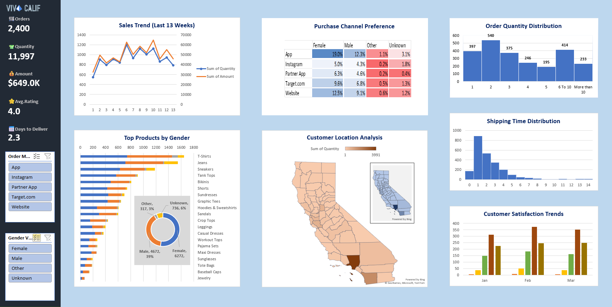

# 📊 Sales Dashboard (Excel Project)

## 📌 Overview
This project presents an interactive Sales Dashboard built using Microsoft Excel. It is created to analyze sales performance, customer behavior, and delivery efficiency.

The dashboard provides clear insights into weekly sales trends, purchase channels, and customer satisfaction, helping in better decision-making.

Through this project, I learned how to use Excel tools like pivot tables, charts, and slicers to transform raw data into meaningful insights.

## 📷 Dashboard Preview

## 🔍 Features
- 📈 Sales Trend Analysis (Last 13 Weeks)
- 🛒 Purchase Channel Preference Analysis
- 📦 Order Quantity Distribution Insights
- 🚚 Shipping Time Distribution Analysis
- 🏆 Top Products by Gender Analysis
- 🌍 Customer Location Analysis
- ⭐ Customer Satisfaction Trends

## 🛠 Tools & Technologies
- Microsoft Excel
- Data Analysis
- Pivot Tables
- Pivot Charts
- Slicers & Filters
- KPI Indicators
- Map Visualization

## 📊 Key Insights
- Sales vary across the 13-week period
- App and Website are the main purchase channels
- Most orders are between 1–3 items
- Faster delivery improves customer satisfaction
- Customer preferences vary by gender and location

## 📁 Files Included
- `sales_dashboard.xlsx` – Excel dashboard file
- `sales_dashboard.png` – Dashboard screenshot

## 🚀 How to Use
1. Download the Excel file  
2. Open it in Microsoft Excel  
3. Use slicers to filter data and explore insights 

## 👤 Author
Vineela Neelam  

📧 Email: neelamvineela752@gmail.com  
GitHub: https://github.com/Vineelaneelam07 